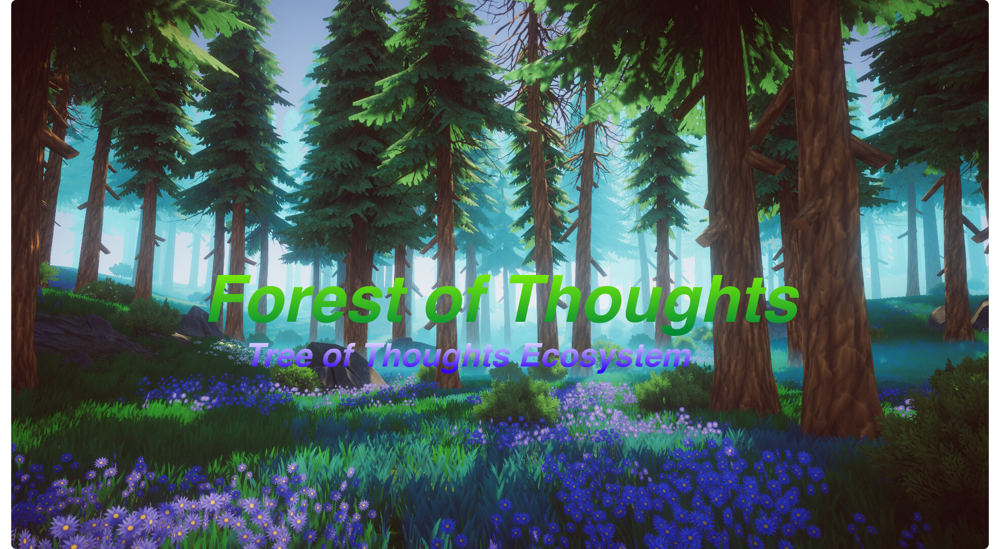

# Forest of Thoughts Ecosystem 🌳🌲🌴🌿🍃

## Tree of Thoughts Easy Plug In and Play
My implementation of Tree of Thoughts (ToT) an all-new powerful and flexible algorithm that advances model reasoning by a whopping 70%. This is a plug-and-play version; connect your own models and enjoy superintelligent reasoning!

[Repository Link](https://github.com/ysymyth/tree-of-thought-llm)

## Official Implementation of "Tree of Thoughts: Deliberate Problem Solving with Large Language Models"

Official implementation for paper Tree of Thoughts: Deliberate Problem Solving with Large Language Models with code, prompts, model outputs. Also check its tweet thread in 1min.

[Official implementation for paper Tree of Thoughts: Deliberate Problem Solving with Large Language Models with code, prompts, model outputs. Also check its tweet thread in 1min](https://github.com/ysymyth/tree-of-thought-llm)

# Projects in the Tree of Thoughts Ecosystem
Projects that use Tree of Thoughts to increase reasoning!

## The Compiler
A novel child project under the Tree of Thoughts (ToT) paradigm. This project is crafted with the intent of making autonomous programming not just a reality, but an effortless task for you.

In essence, The Compiler allows you to "grow" any program you can dream of. By providing a high-level specification of the product you would like, you can sit back and let The Compiler do the heavy lifting.

[GITHUB REPOSITORY](https://github.com/kyegomez/the-compiler)

## Meta TOT - Meta Tree of Thoughts

Meta TOT (Meta Tree of Thoughts) aims to enhance the Tree of Thoughts (TOT) language algorithm by using a secondary agent to critique and improve the primary agent's prompts. This innovative approach allows the primary agent to generate more accurate and relevant responses based on the feedback from the secondary agent.

(GITHUB REPOSITORY)[https://github.com/kyegomez/Meta-Tree-Of-Thoughts]

# Join Agora, Creators United
This implementation of Tree of Thoughts is brought to you by Agora, Agora advances Humanity with open source SOTA Multi-Modality AI research!

[Join our Discord and contribute to this project](https://discord.gg/qUtxnK2NMf)
